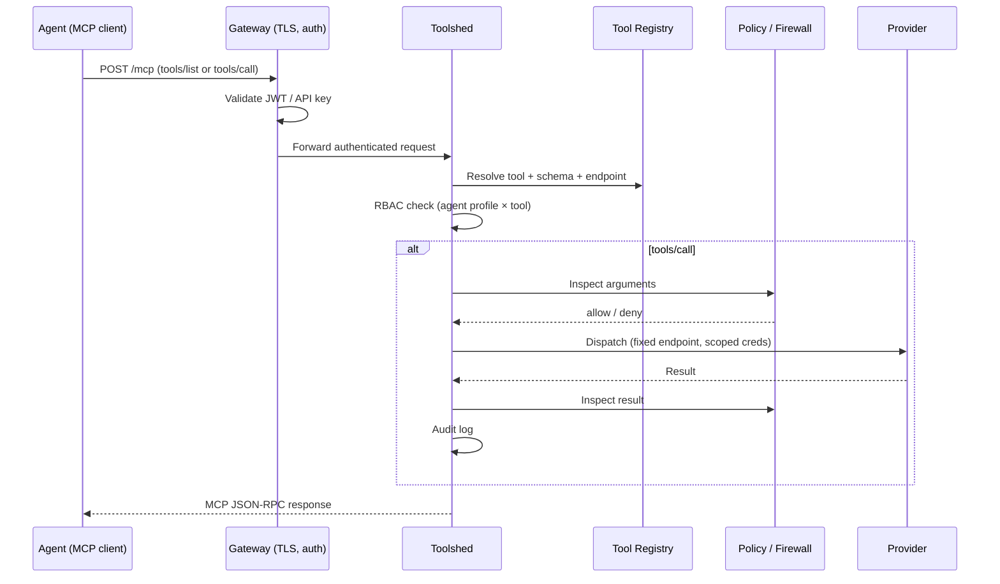

# MCP Toolshed — Research Seed

Research compiled from engineering blogs, InfoQ, enterprise case studies, open-source reference implementations, and the MCP spec. Goal: inform a **standalone MCP Toolshed module template** for Render users.

---

## 1. What is a Toolshed?

The term **Toolshed** was coined at Stripe. It is not an official MCP spec primitive — it is an **organizational architecture pattern**: one centralized MCP surface that aggregates hundreds of tools from many backends, while agents connect to a **single endpoint** instead of dozens of separate MCP servers.

### Stripe (canonical reference)

Source: [Minions Part 2 — Stripe Engineering](https://stripe.dev/blog/minions-stripes-one-shot-end-to-end-coding-agents-part-2)

Key facts from Stripe's public write-up:

- Stripe built **Toolshed** because they had many agent systems (no-code builder, custom services, CLI agents, Slack bots, Minions, third-party tools) that all needed overlapping MCP capabilities.
- Toolshed hosts **~500 MCP tools** spanning internal systems and SaaS platforms.
- **One shared capability layer**: adding a tool to Toolshed immediately makes it available to their entire fleet of hundreds of agents.
- **Curated subsets per agent**: agents perform best with a "smaller box." Minions get an intentionally small default toolset; engineers can add thematically grouped tool bundles per user.
- **Security is layered**: a security control framework governs destructive actions; devboxes run in QA with no production data, no arbitrary egress.
- Toolshed is used for **dynamic context gathering** — docs, tickets, build status, code intelligence — complementing static filesystem rules.

Secondary synthesis (not from Stripe directly): third-party analyses estimate **~15 tools exposed per agent** for a given task, vs. the full 500-tool catalog. The "surgical subset" pattern is widely cited as essential for LLM reasoning quality.

Related reads:
- [Sourcegraph — MCP stories from the field](https://sourcegraph.com/blog/mcp-stories-from-the-field) — commentary on Stripe's gate-for-MCPs pattern and discoverability concerns
- [ByteByteGo — How Stripe's Minions Ship 1,300 PRs a Week](https://blog.bytebytego.com/p/how-stripes-minions-ship-1300-prs)
- [QANDA AX — MCP Server Development Guide](https://ax.qanda.ai/en/blogs/mcp-server-guide) — practical Toolshed pattern breakdown
- [VirtusLab — Toolshed model guide](https://visdom-maturity-matrix.virtuslab.com/guides/infrastructure/toolshed-model-400-tools-behind-one-mcp-stripe) — maturity-model framing

---

## 2. Industry Consensus (2025–2026)

By late 2025 / early 2026, enterprise engineering orgs converged on a pattern that maps closely to Toolshed, usually called **Gateway + Registry**:

| Layer | Role |
|-------|------|
| **Registry (control plane)** | Catalog of tools/servers, ownership, versions, RBAC, audit, federation |
| **Gateway (data plane)** | Single authenticated ingress; routes `tools/list` and `tools/call`; enforces policy |
| **Providers (backends)** | Actual tool implementations — REST adapters, domain MCP servers, SaaS bridges |
| **Agent clients** | Cursor, Claude Code, custom agents — connect to gateway, not raw backends |

### InfoQ coverage

**[Introducing the MCP Registry (Sep 2025)](https://www.infoq.com/news/2025/09/introducing-mcp-registry/)**
- Official MCP Registry launched as federated "source of truth" for server discovery.
- Linux Foundation accepted Solo.io's **Agentgateway** as an AI-native proxy/data plane for agent-to-tool traffic.
- Near-term developer flow: clients query registry → install servers → gateway enforces authN/Z, rate limits, OTel telemetry.
- Trade-offs: curation, governance, schema drift across public/private sub-registries; preview had no durability guarantees.

**[AAIF MCP Dev Summit recap (Apr 2026)](https://www.infoq.com/news/2026/04/aaif-mcp-summit/)**
- **Gateway + registry = dominant architectural consensus** (AWS, Uber, Docker, Kong, Solo.io all aligned).
- Alex Salazar (Arcade.dev): sharp line between **reasoning layer** (LLM) and **action layer** (governance, auth, mutation control).
- **Context bloat reframed as client-side problem**: Claude Code's progressive tool discovery / MCP tool search can cut tool-definition token usage ~85%.
- Uber: MCP Gateway + Registry as control plane; auto-exposes thousands of internal endpoints; GenAI Gateway does PII redaction; **60k+ agent executions/week**.
- Amazon: internal MCP discovery infra; bundles tools + skills + SOPs into composable agent configs; scans for "lethal trifecta" combinations.

### Enterprise scale examples

| Org | Pattern | Scale signal |
|-----|---------|--------------|
| **Stripe** | Centralized Toolshed MCP server | ~500 tools, hundreds of agents, curated subsets |
| **Uber** | Gateway + Registry + GenAI Gateway | 10k+ services → MCP tools; 1,500+ monthly active agents |
| **Amazon** | Registry + agent config bundles | Tens of thousands of builders; security scanning at registration |
| **Microsoft** | MCP Gateway (K8s) | Tool Gateway Router behind `/mcp`; session-aware routing |

Sources:
- [AWS Open Source — Governing AI Assets at Scale with MCP Gateway and Registry](https://aws.amazon.com/blogs/opensource/governing-ai-assets-at-scale-with-mcp-gateway-and-registry/)
- [Microsoft MCP Gateway docs](https://microsoft.github.io/mcp-gateway/)
- [TM Dev Lab — Production-Ready MCP #2: Gateway Architecture](https://www.tmdevlab.com/mcp-gateway-architecture-enterprise.html)
- [TrueFoundry — Centralized MCP Registry Architecture](https://www.truefoundry.com/blog/centralized-mcp-registry-architecture)

---

## 3. Core Architectural Principles

Distilled from Stripe, VirtusLab, enterprise gateways, and the MCP spec.

### 3.1 Aggregation, not monolith

The gateway is a **thin proxy**. It should pass through well-formed MCP requests without heavy transformation. Intelligence lives in tool implementations and policy engines, not routing logic.

```
Agent (MCP client)
    → Gateway (auth, RBAC, rate limits, audit)
        → Toolshed (discovery, schema validation, dispatch, quotas)
            → Provider A (internal REST)
            → Provider B (remote MCP server)
            → Provider C (SaaS API)
```

### 3.2 Curated exposure beats full catalog

Never dump 400 tool schemas into every agent session.

**Template decision:** use **`search_tools` as the primary entry point** — not static per-agent allowlists. Agents discover tools on demand; RBAC filters what search returns (see §9.4).

Other techniques worth knowing (industry patterns, not all needed in v0.1):
1. **Progressive discovery** — `search_tools` + `get_tool_schema` meta-tools (MCP-Toolshed OSS, Claude Code)
2. **Per-user tool bundles** — optional tags on tools; search can filter by bundle
3. **Client-side deferred loading** — MCP clients load tool defs on demand
4. **Static profiles** — Stripe's approach; useful for fully deterministic agents but heavier to maintain

### 3.3 Namespace conventions

At scale, naming collisions kill discoverability. Recommended pattern:

```
{domain}.{resource}.{action}
```

Examples: `render.service.create`, `github.pr.merge`, `jira.ticket.create`

### 3.4 Unified RBAC and audit

Centralize authorization at the gateway/toolshed — not per-backend. Every `tools/call` should log: caller identity, tool name, arguments (redacted), result status, latency, provider.

### 3.5 Two-tier trust for providers

Uber's model is instructive:
- **Internal providers**: lighter scrutiny, auto-generated from service metadata
- **External / third-party providers**: rigorous review, blocked by default in production

### 3.6 Stateless gateway, explicit state handles

Per MCP spec (2026): servers with no protocol-level session should return **explicit handles** for multi-step state (carts, browser contexts, transactions). The toolshed itself should be stateless for request processing; use Redis/Postgres for quotas, sessions, and audit.

### 3.7 Rug-pull / schema integrity defense

Enterprise gateways pin approved tool manifests (SHA256 of descriptions/schemas). At `tools/list` time, compare live backend schemas to pinned manifests; drop or block tools that mutated without review.

---

## 4. Open-Source Reference Implementations

### 4.1 [derrickSh43/MCP-Toolshed](https://github.com/derrickSh43/MCP-Toolshed)

Closest OSS match to the Stripe *name* and pattern. Explicitly a reference implementation.

**Architecture highlights:**
- Pluggable, policy-aware MCP server behind identity-aware gateway (Kong)
- **Reviewed tool registry** — allowed tools, schemas, fixed endpoints
- Meta-tools: `search_tools`, `get_tool_schema`, pinned schemas
- **Agentic Firewall** — inspects arguments pre-call and results post-call (HTTP contract, decoupled)
- **Redis** for shared quotas across replicas
- **Streamable HTTP**, stateless JSON-response mode
- K8s deployment: 3 replicas, HPA, PDB, health probes
- External providers blocked by default in production

**Suggested project layout (from repo):**
```
toolshed/           # core server
config/
  tool-registry.json
providers/          # one dir per backend adapter
deploy/kubernetes/
tests/
```

### 4.2 [agentic-community/mcp-gateway-registry](https://github.com/agentic-community/mcp-gateway-registry)

Broader "AI asset registry" — MCP servers, agents (A2A), skills, custom entities.

**Highlights:**
- **Data plane** (nginx) + **control plane** (FastAPI registry)
- IdP integration: Keycloak, Entra, Okta, Auth0, Cognito
- **Virtual MCP servers** — aggregate tools from many backends behind one endpoint
- **Semantic tool discovery** — NL search over tool catalog
- **Per-user egress OAuth** — vault per-user SaaS tokens, inject on outbound calls
- Federation across registries (LOB, public MCP registry, Bedrock AgentCore)
- Deploy targets: EKS, ECS, Docker Compose

### 4.3 [Microsoft MCP Gateway](https://microsoft.github.io/mcp-gateway/)

K8s-native; Tool Gateway Router as intelligent MCP server behind `/mcp`.

- Register tool servers with metadata
- Router analyzes `tools/call` and forwards to correct backend
- Session affinity for stateful connections

### 4.4 Official MCP Registry

- API: `registry.modelcontextprotocol.io`
- Federated discovery substrate; namespace-verified servers (reverse-DNS: `io.github.user/server`)
- Enterprise toolsheds can **mirror** public registry entries into private catalogs

---

## 5. Request Flow (reference design)

Synthesized from MCP-Toolshed, TrueFoundry, and Uber/AWS patterns:



### `tools/list` optimization

Do **not** fan out synchronously to every provider on every list request.

Pattern from TrueFoundry:
1. Registry stores cached tool metadata per provider
2. Gateway returns RBAC-filtered union from cache
3. Refresh on cache miss or `listChanged` notification
4. Deterministic ordering (MCP spec recommendation — improves prompt cache hit rates)

---

## 6. Security Model Checklist

From Stripe, Sourcegraph commentary, Amazon "lethal trifecta," and enterprise gateways:

| Control | Purpose |
|---------|---------|
| **Identity at gateway** | Every request tied to user/service principal |
| **Least-privilege tool profiles** | Agent gets minimum tools for task |
| **Credential isolation** | Providers hold secrets; agents never see raw API keys |
| **Egress control** | Block arbitrary outbound from providers; allowlist destinations |
| **Environment isolation** | Agents run in sandbox/QA, not production (Stripe devbox model) |
| **Argument inspection** | Block PII exfil, destructive mutations, prompt injection in tool args |
| **Result inspection** | Redact secrets/PII before returning to model |
| **Audit trail** | Immutable log of all tool invocations |
| **Rate limits / quotas** | Per-user, per-tool, per-provider (Redis counters) |
| **Schema pinning** | Detect unauthorized tool definition changes |
| **Approval gates** | High-risk tools require human approval (OPA/Rego pattern) |

---

## 7. Context Window / Discovery Problem

This is the #1 operational issue at scale.

**Problem:** 400 tool definitions can consume 20%+ of a 200k context window before the agent starts reasoning.

**Mitigations (pick 2–3):**

1. **Small static profiles** — ship 10–20 tools per agent role (Stripe default)
2. **Meta-tools** — `search_tools(query)`, `get_tool_schema(name)` instead of full list
3. **Client-side deferred loading** — MCP clients load tool defs on demand
4. **Tool description quality gates** — concise, distinct descriptions; no duplicate semantics

InfoQ / Anthropic benchmark: progressive discovery can reduce tool-definition tokens by ~85%.

---

## 8. Provider Authoring Model

Make it easy for engineers to add tools — this is Stripe's stated goal ("easy to author new tools and automatically discoverable").

**Template decision:** providers are **TypeScript modules**, not JSON in a database. See §9.3 for concrete examples.

### Provider types in the template

| Type | Example | Notes |
|------|---------|-------|
| **`mcp-remote`** | Render, hosted GitHub MCP | Proxy `tools/list` + `tools/call` to upstream URL |
| **`mcp-stdio`** | Slack, community GitHub MCP | Spawn subprocess; bridge stdio |
| **`inline`** | Custom internal APIs | Define tools + handlers in TypeScript |

Each tool carries metadata used by `search_tools` and RBAC: `name`, `description`, `inputSchema`, `risk` (`read` | `write`), `tags`, `toolPrefix`.

---

## 9. Render-Specific Template Considerations

This repo already uses Render MCP in `agentic-app-build-runner` (`RenderMcp`, `mcp.render.com`). A Render Toolshed template should build on that.

### 9.1 Deployment topology on Render

**Template decision: one Web Service + one Postgres database.**

Everything runs in a single process — MCP gateway, provider dispatch, code registry load, and search index. No separate provider services, no Key Value dependency in v0.1.

```
render.yaml
├── toolshed          Web Service   (Node/Bun — gateway + all providers in-process)
└── toolshed-db       Postgres      (audit log, API keys, OAuth tokens — not tool catalog)
```

| Concern | Where it lives |
|---------|----------------|
| MCP endpoint (`/mcp`) | Web Service |
| Tool definitions | **Code registry** — `providers/*.ts`, loaded at startup |
| Provider dispatch | In-process adapters inside Web Service |
| RBAC policy | Code (`config/rbac.ts`) + caller identity from auth header |
| Audit trail | Postgres `audit_events` table |
| Search index | In-memory, built from code registry on boot |

Why consolidate:
- Simpler Blueprint — two resources, not five
- Providers are thin adapters (HTTP proxy to remote MCP, or inline handlers), not separate deployables
- Matches "fork and adapt" template ergonomics — users edit code, deploy one service
- Postgres reserved for **runtime state** that must survive restarts (audit, secrets metadata), not tool definitions

Optional v0.2: Key Value for rate-limit counters if you scale to multiple replicas.

### 9.2 Render platform constraints (apply always)

- Ephemeral filesystem — audit logs and token metadata go to Postgres, not local disk
- Free tier spin-down — not suitable for production toolshed; use paid instances
- Bind HTTP to `0.0.0.0:$PORT`; expose Streamable HTTP at `/mcp`
- Provider credentials via env vars / Render secret files — never in the code registry itself

### 9.3 Wiring up providers (render, github, slack, custom)

Users add tools by **creating or editing a provider module** and registering it in `providers/index.ts`. No admin UI, no runtime registration API in v0.1 — PR + deploy is the workflow.

#### Provider types

| Type | When to use | How toolshed gets tools |
|------|-------------|-------------------------|
| **`mcp-remote`** | Existing hosted MCP (Render, GitHub) | Proxy `tools/list` + `tools/call` to upstream URL |
| **`mcp-stdio`** | Local/community MCP servers (Slack npx, etc.) | Spawn subprocess; bridge stdio ↔ in-process dispatch |
| **`inline`** | Custom internal APIs | Define tools + handlers directly in TypeScript |

#### Example: Render (mcp-remote)

Passthrough to the hosted Render MCP server. Tool names are prefixed `render.*`.

```typescript
// providers/render.ts
import { defineMcpRemoteProvider } from "../toolshed/provider.js";

export const render = defineMcpRemoteProvider({
  id: "render",
  url: process.env.RENDER_MCP_URL ?? "https://mcp.render.com/mcp",
  auth: { header: "Authorization", env: "RENDER_API_KEY" }, // Bearer token
  toolPrefix: "render",           // render.list_services, render.create_web_service, …
  risk: "write",                  // default risk tag for RBAC
  tags: ["deploy", "infra"],
});
```

Env vars on the Web Service: `RENDER_API_KEY`, optional `RENDER_MCP_URL`.

#### Example: GitHub (mcp-remote or mcp-stdio)

Most users already have a GitHub MCP config in Cursor/Claude. Toolshed re-hosts it behind one endpoint.

```typescript
// providers/github.ts
import { defineMcpStdioProvider } from "../toolshed/provider.js";

export const github = defineMcpStdioProvider({
  id: "github",
  command: "npx",
  args: ["-y", "@modelcontextprotocol/server-github"],
  env: { GITHUB_PERSONAL_ACCESS_TOKEN: process.env.GITHUB_TOKEN! },
  toolPrefix: "github",
  risk: "write",
  tags: ["code", "pr"],
});
```

Or if using GitHub's hosted MCP when available:

```typescript
export const github = defineMcpRemoteProvider({
  id: "github",
  url: process.env.GITHUB_MCP_URL!,  // or community hosted endpoint
  auth: { header: "Authorization", env: "GITHUB_TOKEN" },
  toolPrefix: "github",
});
```

#### Example: Slack (mcp-stdio)

```typescript
// providers/slack.ts
import { defineMcpStdioProvider } from "../toolshed/provider.js";

export const slack = defineMcpStdioProvider({
  id: "slack",
  command: "npx",
  args: ["-y", "@modelcontextprotocol/server-slack"],
  env: { SLACK_BOT_TOKEN: process.env.SLACK_BOT_TOKEN! },
  toolPrefix: "slack",
  risk: "write",
  tags: ["comms"],
});
```

#### Example: Custom stub (inline)

For internal REST APIs or one-off tools — copy this file and fill in the handler.

```typescript
// providers/custom.ts
import { defineInlineProvider, tool } from "../toolshed/provider.js";

export const custom = defineInlineProvider({
  id: "custom",
  tools: [
    tool({
      name: "custom.ticket.lookup",
      description: "Look up an internal support ticket by ID",
      inputSchema: {
        type: "object",
        properties: { id: { type: "string" } },
        required: ["id"],
      },
      risk: "read",
      tags: ["support"],
      async handler({ id }, ctx) {
        const res = await fetch(`${process.env.TICKET_API_URL}/tickets/${id}`, {
          headers: { Authorization: `Bearer ${process.env.TICKET_API_KEY}` },
        });
        return { content: [{ type: "text", text: await res.text() }] };
      },
    }),
  ],
});
```

#### Registration

```typescript
// providers/index.ts
import { createRegistry } from "../toolshed/registry.js";
import { render } from "./render.js";
import { github } from "./github.js";
import { slack } from "./slack.js";
import { custom } from "./custom.js";

export const registry = createRegistry([render, github, slack, custom]);
```

Deploy flow: edit provider → commit → Render auto-deploys → registry reloads on boot.

**What agents see:** one MCP server URL (`https://toolshed.onrender.com/mcp`). They never configure Render/GitHub/Slack MCP separately.

### 9.4 Discovery + RBAC via `search_tools`

**Template decision:** `search_tools` is the primary discovery and filtering mechanism — not static agent profiles.

#### What `tools/list` returns

Only meta-tools (always visible to authenticated callers):

| Tool | Purpose |
|------|---------|
| `search_tools` | Find tools by natural-language query; **RBAC applied here** |
| `get_tool_schema` | Fetch full input schema for one tool name |
| *(implicit)* `tools/call` on discovered tools | Dispatch to provider |

Agents never receive the full 400-tool catalog in context.

#### How RBAC works through search

RBAC is enforced at three layers (defense in depth):

```
1. search_tools(query)     → returns only tools caller's role may *discover*
2. get_tool_schema(name)   → 403 if caller may not see this tool
3. tools/call(name, args)  → 403 if caller may not *execute* (stricter than discover)
```

Policy lives in code (`config/rbac.ts`), keyed off the caller identity from the MCP auth header (API key → role mapping in Postgres, or JWT claims):

```typescript
// config/rbac.ts
export const roles = {
  analyst: {
    discover: { tags: ["deploy", "code", "support"], maxRisk: "read" },
    execute:  { tags: ["deploy", "code", "support"], maxRisk: "read" },
  },
  implementer: {
    discover: { tags: ["deploy", "code", "support"], maxRisk: "write" },
    execute:  { tags: ["code", "support"], maxRisk: "write" },  // no render.create_*
  },
  deploy-manager: {
    discover: { prefixes: ["render."], maxRisk: "write" },
    execute:  { prefixes: ["render."], maxRisk: "write" },
  },
};
```

`search_tools` implementation sketch:

```typescript
async function searchTools(query: string, caller: Caller) {
  const allowed = registry.allTools().filter(t => canDiscover(caller, t));
  const ranked = rankByQuery(allowed, query);  // keyword or embedding
  return ranked.slice(0, 10).map(t => ({
    name: t.name,
    description: t.description,
    risk: t.risk,
    tags: t.tags,
  }));
}
```

This gives you Stripe's "surgical subset" dynamically — the agent searches for what it needs, and RBAC shapes what comes back. No pre-baked profile per agent type required (though roles still map to policy rules in code).

#### Agent workflow

```
1. Agent connects to https://toolshed.onrender.com/mcp
2. tools/list → [search_tools, get_tool_schema]
3. search_tools("list render services in workspace") → [render.list_services, …]
4. get_tool_schema("render.list_services") → full inputSchema
5. tools/call("render.list_services", { workspaceId: "…" }) → result
```

### 9.5 Integration with Render Factory

The factory already demonstrates:
- Thin ingress gateway (validates webhooks, dispatches workflows)
- Scoped agent capabilities per role
- Workflow-owned authority (models propose, code commits)

A Toolshed module slots in as the **shared MCP capability layer** above sandboxes — same pattern Stripe uses with Minions + Toolshed.

---

## 10. Proposed Module Template Structure

Starter layout for `mcp-toolshed/` in this monorepo:

```
mcp-toolshed/
├── README.md
├── render.yaml                 # Blueprint: one web service + one postgres
├── toolshed/
│   ├── server.ts               # Streamable HTTP MCP server
│   ├── registry.ts             # Load code registry, build search index
│   ├── dispatcher.ts           # Route tools/call to provider adapters
│   ├── provider.ts             # defineMcpRemoteProvider, defineInlineProvider, …
│   ├── meta-tools.ts           # search_tools (RBAC entry point), get_tool_schema
│   └── audit.ts                # Write audit events to Postgres
├── providers/
│   ├── index.ts                # createRegistry([render, github, slack, custom])
│   ├── render.ts               # mcp-remote → mcp.render.com
│   ├── github.ts               # mcp-stdio or mcp-remote
│   ├── slack.ts                # mcp-stdio
│   └── custom.ts               # inline stub — copy for internal APIs
├── config/
│   └── rbac.ts                 # Role → discover/execute rules
├── migrations/
│   └── 001_audit.sql           # audit_events, api_keys (not tool catalog)
├── tests/
└── seed.md                     # this file
```

### Code registry vs. Postgres — split of responsibilities

| Data | Storage | Why |
|------|---------|-----|
| Tool definitions (name, schema, handler, tags, risk) | **Code** (`providers/*.ts`) | Type-checked, git-reviewed, easy to author; redeploy to update |
| RBAC role rules | **Code** (`config/rbac.ts`) | Same — versioned with deploy |
| API key → role mapping | **Postgres** | Runtime secret rotation without redeploy |
| Audit log | **Postgres** | Durable, queryable; survives restarts |
| OAuth tokens (v0.2) | **Postgres** | Per-user SaaS credentials |

On boot: load `providers/index.ts` → build in-memory catalog + search index. Postgres is never the source of truth for *what tools exist*.

### MVP scope (v0.1)

- [ ] Single Web Service — gateway + all providers in one process
- [ ] Single Postgres — audit log + API key table only
- [ ] Code registry with four stub providers: render, github, slack, custom
- [ ] `search_tools` as primary discovery + RBAC filter
- [ ] `get_tool_schema` for on-demand schema loading
- [ ] RBAC enforced at search, schema, and call layers
- [ ] `render.yaml` Blueprint (2 resources)

### v0.2+

- [ ] Key Value for rate-limit counters across replicas
- [ ] Schema pinning / hash validation on provider sync
- [ ] Per-user OAuth egress for SaaS providers
- [ ] Semantic search (embeddings) over tool descriptions
- [ ] Federation with official MCP Registry

---

## 11. Key Design Tensions — Resolved

| Tension | Options | **Decision** |
|---------|---------|--------------|
| Full list vs. search | Static profiles vs. meta-tools | **`search_tools` only** — RBAC filters search results; no static allowlists |
| Monolith vs. microservices | One binary vs. gateway + N provider services | **One Web Service** — providers are in-process adapters, not separate deployables |
| Stateful vs. stateless MCP | Streamable HTTP sessions vs. stateless | **Stateless** per MCP 2026 direction (SEP-1442) |
| Registry in code vs. DB | Code files vs. Postgres catalog | **Code registry** for tool defs; Postgres for audit + runtime secrets only |
| Who authors tools | Platform team vs. any engineer | **PR + deploy** — edit `providers/*.ts`, review in git, ship on merge |

---

## 12. Source Index

### Primary engineering sources
- [Stripe — Minions Part 2 (Toolshed origin)](https://stripe.dev/blog/minions-stripes-one-shot-end-to-end-coding-agents-part-2)
- [Stripe — Minions Part 1](https://stripe.dev/blog/minions-stripes-one-shot-end-to-end-coding-agents)
- [Sourcegraph — MCP stories from the field](https://sourcegraph.com/blog/mcp-stories-from-the-field)

### InfoQ
- [Introducing the MCP Registry (Sep 2025)](https://www.infoq.com/news/2025/09/introducing-mcp-registry/)
- [AAIF MCP Dev Summit (Apr 2026)](https://www.infoq.com/news/2026/04/aaif-mcp-summit/)

### Architecture guides
- [VirtusLab — Toolshed model](https://visdom-maturity-matrix.virtuslab.com/guides/infrastructure/toolshed-model-400-tools-behind-one-mcp-stripe)
- [TrueFoundry — Centralized MCP Registry](https://www.truefoundry.com/blog/centralized-mcp-registry-architecture)
- [TM Dev Lab — Gateway Architecture](https://www.tmdevlab.com/mcp-gateway-architecture-enterprise.html)
- [AI Engineering Academy — MCP Gateways and Registries](https://ai-engineering.academy/learn/13-tools-and-protocols/17-mcp-gateways-and-registries/)
- [QANDA AX — MCP Server Development Guide](https://ax.qanda.ai/en/blogs/mcp-server-guide)
- [Shah Vatsal — MCP Server Factory / Enterprise Registry](https://shahvatsal.com/blog/mcp-server-enterprise-registry-governance-2026)

### Open source
- [MCP-Toolshed (reference impl)](https://github.com/derrickSh43/MCP-Toolshed)
- [MCP Gateway & Registry (AWS/agentic-community)](https://github.com/agentic-community/mcp-gateway-registry)
- [Microsoft MCP Gateway](https://microsoft.github.io/mcp-gateway/)
- [MCP Tools Spec](https://modelcontextprotocol.io/specification/2026-07-28/server/tools)
- [Official MCP Registry](https://registry.modelcontextprotocol.io)

### Enterprise blogs
- [AWS — Governing AI Assets at Scale](https://aws.amazon.com/blogs/opensource/governing-ai-assets-at-scale-with-mcp-gateway-and-registry/)
- [AAIF — MCP Dev Summit recap](https://aaif.io/blog/mcp-is-now-enterprise-infrastructure-everything-that-happened-at-mcp-dev-summit-north-america-2026)

---

## 13. One-Paragraph Summary

A **Toolshed** is not a protocol feature — it is an **aggregation gateway** that exposes many backend tools through one MCP endpoint, with **centralized RBAC/audit** and **pluggable providers**. Stripe proved the pattern at ~500 tools; Uber, Amazon, and Microsoft converged on the same gateway+registry architecture at enterprise scale. For Render users, the template is **one Web Service + one Postgres**: the service runs gateway, search, and all provider adapters in-process; Postgres holds audit logs and API keys only. Tool definitions live in a **code registry** (`providers/*.ts`) — git-reviewed, type-checked, redeployed to update. Agents connect to a single `/mcp` endpoint, call **`search_tools`** to discover what's available (RBAC filters results), then **`get_tool_schema`** + **`tools/call`**. Ship with four provider stubs: **render** (mcp-remote), **github** (mcp-stdio), **slack** (mcp-stdio), **custom** (inline handler template).
